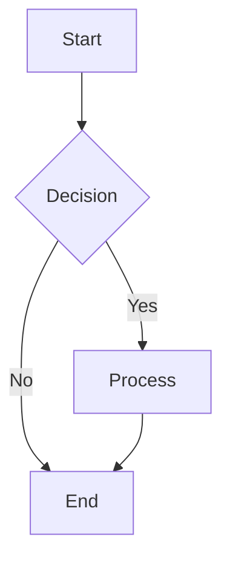
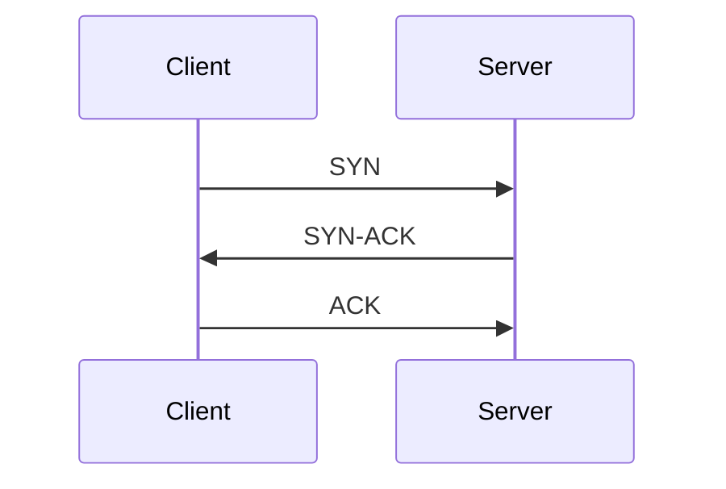
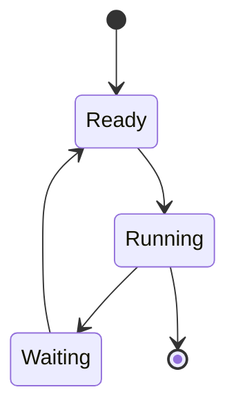

# Multimedia Capabilities Guide

This document explains the multimedia features added to the Qwen3 fine-tuning project, including image extraction, OCR, vision-language integration, and figure generation.

---

## 🖼️ Overview

The project now has comprehensive multimedia capabilities to:
1. **Extract images** from PowerPoint slides and PDFs
2. **Extract text** from diagrams using OCR (Optical Character Recognition)
3. **Generate captions** for images using vision-language models (BLIP)
4. **Generate diagrams** from text descriptions (Mermaid, PlantUML, ASCII art)

These features enable the RAG system to understand and generate visual content, making it more effective for technical documentation.

---

## 📦 Installation

### Required Packages

```bash
# Install Python packages
pip install pytesseract opencv-python Pillow transformers torch
```

### System Dependencies

**Tesseract OCR** (required for text extraction):

- **Windows**: `choco install tesseract` or download from [GitHub](https://github.com/UB-Mannheim/tesseract/wiki)
- **Linux**: `sudo apt-get install tesseract-ocr`
- **macOS**: `brew install tesseract`

**Mermaid CLI** (optional, for rendering diagrams):

```bash
npm install -g @mermaid-js/mermaid-cli
```

**PlantUML** (optional, for rendering diagrams):

Download from [plantuml.com](https://plantuml.com/download)

---

## 🎯 Feature 1: Image Extraction

### What It Does
Extracts images from PowerPoint presentations with metadata and optional captions.

### Usage

```python
from pathlib import Path
from src.data_processing.extract_images import ImageExtractor

# Initialize extractor
extractor = ImageExtractor(
    save_images=True,     # Save images to disk
    use_ocr=True,         # Enable OCR (if available)
    use_captioning=True   # Enable BLIP captioning (if available)
)

# Extract from a PowerPoint file
images = extractor.extract_images_from_presentation(
    Path("data/raw/slides/lecture1.pptx")
)

# Each image contains:
# - slide_number: Which slide it came from
# - image_format: PNG, JPEG, etc.
# - image_size: (width, height)
# - saved_path: Where the image was saved
# - has_caption: Whether there's a text caption
# - caption: The caption text (if any)
```

### Command-Line Usage

```bash
# Extract from single file
python src/data_processing/extract_images.py --file "data/raw/slides/lecture1.pptx"

# Extract from all files in directory
python src/data_processing/extract_images.py --input-dir "data/raw/slides"

# Extract without OCR
python src/data_processing/extract_images.py --input-dir "data/raw/slides" --no-ocr
```

### Output Structure

```
data/processed/images/
├── abc123def456.png          # Image files (named by hash)
├── abc123def789.jpeg
└── lecture1_images.json      # Metadata
```

---

## 📝 Feature 2: OCR (Optical Character Recognition)

### What It Does
Extracts text from diagrams, flowcharts, and images using Tesseract OCR with intelligent preprocessing.

### Module: `ocr_processor.py`

#### OCRProcessor Class

```python
from src.data_processing.ocr_processor import OCRProcessor
from PIL import Image

# Initialize
ocr = OCRProcessor(lang='eng')

# Extract text from image
image = Image.open("diagram.png")
result = ocr.extract_text(image)

print(f"Text: {result['text']}")
print(f"Confidence: {result['confidence']:.2f}")
print(f"Word count: {result['word_count']}")
```

#### DiagramClassifier Class

```python
from src.data_processing.ocr_processor import DiagramClassifier

# Initialize
classifier = DiagramClassifier()

# Classify diagram type
image = Image.open("diagram.png")
diagram_type, keywords = classifier.classify(image)

print(f"Diagram type: {diagram_type}")
print(f"Keywords: {keywords}")
```

### Supported Diagram Types

1. **Flowcharts** - process flows, decision trees
2. **State Diagrams** - state machines, FSMs
3. **Network Diagrams** - topologies, connections
4. **Sequence Diagrams** - message flows, interactions
5. **Architecture Diagrams** - system designs
6. **Graphs** - bar charts, line charts
7. **Charts** - pie charts, scatter plots
8. **Timelines** - schedules, Gantt charts
9. **Memory Diagrams** - heap, stack layouts
10. **Protocol Diagrams** - packet formats, handshakes

### Image Preprocessing

The OCR processor automatically:
- Converts to grayscale
- Applies thresholding (binary conversion)
- Denoises using morphological operations
- Enhances contrast for better text detection

---

## 🔍 Feature 3: Vision-Language Integration

### What It Does
Uses BLIP (Bootstrapping Language-Image Pre-training) to generate natural language descriptions of images.

### Module: `vision_language.py`

#### ImageCaptioner Class

```python
from src.inference.vision_language import ImageCaptioner
from PIL import Image

# Initialize
captioner = ImageCaptioner()

# Generate caption
image = Image.open("diagram.png")
caption = captioner.generate_caption(image)
print(f"Caption: {caption}")

# Generate description for diagrams
description = captioner.describe_diagram(image)
print(f"Diagram description: {description}")

# Conditional caption with prompt
caption = captioner.generate_conditional_caption(
    image,
    text_prompt="a diagram showing",
    max_length=100
)
```

#### ImageClassifier Class

Uses CLIP for zero-shot image classification:

```python
from src.inference.vision_language import ImageClassifier

# Initialize
classifier = ImageClassifier()

# Classify diagram type
image = Image.open("diagram.png")
results = classifier.classify_diagram_type(image)

for diagram_type, probability in results.items():
    print(f"{diagram_type}: {probability:.3f}")

# Check if educational content
is_educational = classifier.is_educational_content(image)
print(f"Educational: {is_educational}")
```

#### VisionLanguageProcessor Class

Complete pipeline combining captioning and classification:

```python
from src.inference.vision_language import VisionLanguageProcessor

# Initialize
processor = VisionLanguageProcessor()

# Process image
result = processor.process_image(image)

print(f"Caption: {result['caption']}")
print(f"Diagram description: {result['diagram_description']}")
print(f"Is educational: {result['is_educational']}")
print(f"Diagram types: {result['diagram_type']}")

# Generate text alternative (for accessibility)
alt_text = processor.extract_text_alternative(image)
print(f"Alt text: {alt_text}")
```

### Model Details

- **BLIP**: Salesforce/blip-image-captioning-base
  - Generates natural language captions
  - Supports conditional generation
  - ~450M parameters

- **CLIP**: openai/clip-vit-base-patch32
  - Zero-shot image classification
  - Text-image similarity
  - ~150M parameters

---

## 🎨 Feature 4: Figure Generation

### What It Does
Generates diagrams from text descriptions using multiple formats: Mermaid, PlantUML, and ASCII art.

### Module: `figure_generator.py`

#### Basic Usage

```python
from src.inference.figure_generator import FigureGenerator

# Initialize
generator = FigureGenerator()

# Generate Mermaid diagram
mermaid_result = generator.generate_mermaid_diagram(
    description="Explain the TCP three-way handshake",
    diagram_type="sequence"
)

print(mermaid_result['code'])  # Mermaid code
print(mermaid_result['can_render'])  # Can render to image?
if mermaid_result['image_path']:
    print(f"Saved to: {mermaid_result['image_path']}")

# Generate ASCII art
ascii_result = generator.generate_ascii_art("Explain TCP handshake")
print(ascii_result['art'])

# Generate PlantUML
plantuml_result = generator.generate_plantuml_diagram("sequence diagram")
print(plantuml_result['code'])
```

#### Automatic Diagram Detection

```python
# Detect if user is asking for a diagram
question = "Can you draw a flowchart of the process?"
needs_diagram = generator.detect_diagram_need(question, "")

if needs_diagram:
    diagram_type = generator.suggest_diagram_type(question)
    print(f"Suggested type: {diagram_type}")
```

#### Helper Function

```python
from src.inference.figure_generator import generate_diagram_for_answer

# Automatically generate appropriate diagram
result = generate_diagram_for_answer(
    question="Draw the TCP handshake",
    answer="TCP uses a three-way handshake..."
)

if result:
    for diagram in result['diagrams']:
        if diagram['type'] == 'ascii':
            print(diagram['art'])
        elif diagram['type'] == 'mermaid':
            print(diagram['code'])
```

### Supported Diagram Types

1. **Sequence Diagrams** - Protocol interactions (e.g., TCP handshake)
2. **Flowcharts** - Process flows, algorithms
3. **State Diagrams** - Process states, FSMs
4. **Network Diagrams** - Network topologies
5. **Architecture Diagrams** - System designs
6. **Class Diagrams** - UML class diagrams
7. **ER Diagrams** - Entity-relationship diagrams
8. **Timelines** - Gantt charts, schedules

### Built-in Templates

The generator includes pre-built templates for common OS/Networks concepts:

1. **TCP Handshake** - Three-way handshake sequence
2. **Process States** - State transition diagram
3. **Deadlock** - Circular wait visualization
4. **OSI Model** - 7-layer architecture

Example:

```python
# These are automatically detected and generated
questions = [
    "Explain TCP three-way handshake",
    "Show process state diagram",
    "Illustrate deadlock condition",
    "Draw OSI model layers"
]

for question in questions:
    ascii_diagram = generator.generate_ascii_art(question)
    print(ascii_diagram['art'])
```

### Mermaid Syntax Examples

#### Flowchart


#### Sequence Diagram


#### State Diagram


---

## 🔄 Integration with RAG System

### Enhanced Retrieval with Image Context

The RAG system can now retrieve documents that contain images with OCR text:

```python
from src.inference.rag_system import RAGSystem

# Initialize
rag = RAGSystem()

# Query with image-aware context
query = "What is the TCP handshake diagram?"
context = rag.get_context(query, include_images=True)

# Context now includes:
# - Text from documents
# - OCR text from diagrams
# - Image captions
```

### Automatic Figure Generation in Responses

When the model detects a diagram request, it can generate figures:

```python
from src.inference.query_processor import QueryProcessor
from src.inference.figure_generator import FigureGenerator

processor = QueryProcessor()
generator = FigureGenerator()

# Process query
question = "Draw the process state diagram"
answer = processor.process(question)

# Check if diagram is needed
diagram_result = generate_diagram_for_answer(question, answer)

if diagram_result:
    # Include diagrams in response
    final_response = f"{answer}\n\n{diagram_result['diagrams'][0]['art']}"
```

---

## 📊 Example Outputs

### 1. TCP Handshake (ASCII)

```
TCP Three-Way Handshake:

    Client                    Server
       |                         |
       |    SYN (seq=100)        |
       |------------------------>|
       |                         |
       |  SYN-ACK (seq=300,      |
       |          ack=101)       |
       |<------------------------|
       |                         |
       |    ACK (seq=101,        |
       |         ack=301)        |
       |------------------------>|
       |                         |
       |   [Connection Ready]    |
```

### 2. Process States (ASCII)

```
Process State Diagram:

         +-------+
         |  NEW  |
         +-------+
             |
             | admitted
             v
         +-------+     interrupt    +----------+
    +--->| READY |<-----------------|  RUNNING |
    |    +-------+                  +----------+
    |        |                           |    |
    |        | dispatch                  |    | exit
    |        +-------------------------->|    |
    |                                    |    v
    |    +----------+    I/O complete    | +------------+
    +----| WAITING  |<-------------------+ | TERMINATED |
         +----------+                      +------------+
```

### 3. OCR Extraction

Input: Image with text "TCP/IP Protocol Stack"

Output:
```json
{
  "text": "TCP/IP Protocol Stack\nApplication Layer\nTransport Layer\nInternet Layer\nNetwork Access Layer",
  "confidence": 92.5,
  "word_count": 11,
  "is_diagram": true,
  "diagram_type": "architecture"
}
```

### 4. Image Captioning

Input: Diagram of network topology

Output:
```
Caption: "a diagram showing computers connected to a router and switch"
Diagram Description: "network topology diagram with multiple nodes"
Classification: network_diagram (0.89), architecture (0.08), flowchart (0.02)
```

---

## 🚀 Quick Start

### 1. Extract Images from Training Materials

```bash
# Create slides directory
mkdir -p data/raw/slides

# Add your PowerPoint files there
cp path/to/lecture*.pptx data/raw/slides/

# Extract images with OCR
python src/data_processing/extract_images.py --input-dir data/raw/slides
```

### 2. Test OCR on a Diagram

```python
from src.data_processing.ocr_processor import OCRProcessor
from PIL import Image

ocr = OCRProcessor()
image = Image.open("data/processed/images/diagram.png")
result = ocr.extract_from_diagram(image)

print(f"Text: {result['text']}")
print(f"Diagram type: {result['diagram_type']}")
```

### 3. Generate a Figure

```python
from src.inference.figure_generator import FigureGenerator

generator = FigureGenerator()

# ASCII art (no dependencies)
ascii_result = generator.generate_ascii_art("TCP handshake")
print(ascii_result['art'])

# Mermaid code
mermaid_result = generator.generate_mermaid_diagram(
    "TCP handshake", "sequence"
)
print(mermaid_result['code'])
```

### 4. Caption an Image

```python
from src.inference.vision_language import ImageCaptioner
from PIL import Image

captioner = ImageCaptioner()
image = Image.open("diagram.png")
caption = captioner.generate_caption(image)

print(f"This image shows: {caption}")
```

---

## ⚙️ Configuration

All multimedia features respect the project's configuration:

```yaml
# configs/model_config.yaml
multimedia:
  enable_ocr: true
  enable_captioning: true
  ocr_language: "eng"
  caption_max_length: 50
  save_images: true
  image_output_dir: "data/processed/images"
```

---

## 🎓 Use Cases

### 1. Training Data Enhancement
- Extract diagrams from lecture slides
- Add OCR text to vector database
- Include image captions in context

### 2. Question Answering
- Detect when user asks for a diagram
- Generate appropriate visualization
- Return both text explanation + diagram

### 3. Evaluation
- Test model's understanding of visual concepts
- Verify if generated explanations match diagrams
- Compare text descriptions with image captions

### 4. Documentation Generation
- Auto-generate diagrams for technical concepts
- Create visual learning materials
- Export diagrams in multiple formats

---

## 🔧 Troubleshooting

### OCR Not Working

**Error**: `TesseractNotFoundError`

**Solution**:
1. Install Tesseract OCR on your system (see Installation section)
2. Add Tesseract to PATH (Windows)
3. Test: `tesseract --version`

### BLIP Model Not Loading

**Error**: `OutOfMemoryError`

**Solution**:
- Use CPU instead of GPU: Set `device="cpu"` in ImageCaptioner
- Use smaller model: "Salesforce/blip-image-captioning-base"
- Reduce batch size when processing multiple images

### Mermaid CLI Not Found

**Error**: `mmdc command not found`

**Solution**:
- Install Node.js first
- Run: `npm install -g @mermaid-js/mermaid-cli`
- Or use Mermaid code without rendering (still useful!)

### Low OCR Accuracy

**Problem**: Extracted text has errors

**Solutions**:
1. Preprocess image:
   ```python
   ocr = OCRProcessor()
   preprocessed = ocr.preprocess_image(image)
   result = ocr.extract_text(preprocessed)
   ```

2. Specify language:
   ```python
   ocr = OCRProcessor(lang='eng+fra')  # English + French
   ```

3. Increase image resolution before OCR

---

## 📚 API Reference

### ImageExtractor

| Method | Description |
|--------|-------------|
| `extract_images_from_presentation(pptx_path)` | Extract all images from PowerPoint |
| `extract_images_from_slide(slide, slide_num, filename)` | Extract from single slide |
| `get_statistics(images)` | Get extraction statistics |

### OCRProcessor

| Method | Description |
|--------|-------------|
| `extract_text(image)` | Extract text from image |
| `detect_text_regions(image)` | Find text regions |
| `is_diagram(image)` | Check if image is a diagram |
| `extract_from_diagram(image)` | OCR + diagram classification |
| `preprocess_image(image)` | Enhance image for OCR |

### ImageCaptioner

| Method | Description |
|--------|-------------|
| `generate_caption(image, max_length=50)` | Generate caption |
| `generate_conditional_caption(image, prompt)` | Caption with prompt |
| `describe_diagram(image)` | Diagram-specific description |
| `batch_caption(images)` | Caption multiple images |

### FigureGenerator

| Method | Description |
|--------|-------------|
| `generate_mermaid_diagram(description, type)` | Generate Mermaid code |
| `generate_ascii_art(description)` | Generate ASCII diagram |
| `generate_plantuml_diagram(description)` | Generate PlantUML code |
| `detect_diagram_need(question, answer)` | Check if diagram needed |
| `suggest_diagram_type(text)` | Suggest appropriate type |

---

## 🎯 Next Steps

1. **Add training slides**: Copy your lecture materials to `data/raw/slides/`
2. **Extract images**: Run `python src/data_processing/extract_images.py`
3. **Build vector DB**: Re-run `python src/data_processing/build_vectordb.py` to include image content
4. **Test queries**: Try asking questions that request diagrams
5. **Fine-tune model**: Train with image-enriched dataset

---

## 📖 Additional Resources

- [Tesseract OCR Documentation](https://github.com/tesseract-ocr/tesseract)
- [BLIP Model Paper](https://arxiv.org/abs/2201.12086)
- [Mermaid Documentation](https://mermaid.js.org/)
- [PlantUML Documentation](https://plantuml.com/)
- [CLIP Paper](https://arxiv.org/abs/2103.00020)

---

*Last updated: 2024*
